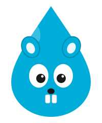

<p align="center">
  
</p>

# gota

[](https://github.com/pabloos/gota/actions/workflows/ci.yml)
[](https://codecov.io/gh/pabloos/gota)
[](LICENSE)

`gota` generates an OpenAPI 3.1 specification from Go source code. It's
code-first with real static inference, not annotation-only:

1. **AST inference** — routes, path parameters, handler names, and a
   handler's doc-comment prose as the operation description — everything
   deducible without programmer help, via `go/ast`, `go/types` and
   `golang.org/x/tools`.
2. **`gota:` comments** — structured YAML fragments written directly in
   OpenAPI vocabulary, placed above a handler. The comment *is* OpenAPI,
   not an intermediate DSL, which makes it easy for both humans and AI
   agents to write or edit.

Declared (comment) fields always win; inferred fields fill in the rest.

```go
// gota:
//   summary: Get a user by ID
//   parameters:
//     - name: id
//       in: path
//       required: true
//       schema:
//         type: integer
//   responses:
//     '200':
//       description: The requested user
func GetUser(w http.ResponseWriter, r *http.Request) { ... }
```

gota is pre-1.0 — its inference surface is still growing (see the
[CHANGELOG](CHANGELOG.md)) — but every run emits a document that is validated
as OpenAPI 3.1 before it's written, so the output is always well-formed.

## Install

```sh
go install github.com/pabloos/gota/cmd/gota@latest
```

Or run it without installing, and without adding gota to your `go.mod`:

```sh
go run github.com/pabloos/gota/cmd/gota@latest --dir . --out openapi.yaml
```

Building gota needs Go 1.23+. To analyze a project that itself requires a
newer Go version, build gota with a current toolchain — see
[CONTRIBUTING](CONTRIBUTING.md).

## Quickstart

Point gota at a Go project and it writes an OpenAPI 3.1 document:

```sh
gota --dir ./path/to/project --out openapi.yaml
```

Routes, path parameters, request/response schemas, and the doc comment above
each handler are read straight from the code — no annotations required. For
anything the code can't express — a response description, an example,
authentication — add a `gota:` comment above the handler, written in plain
OpenAPI:

```go
// ListUsers returns every registered user.
//
// gota:
//   responses:
//     '200':
//       description: All users.
func ListUsers(w http.ResponseWriter, r *http.Request) {
	json.NewEncoder(w).Encode(users)
}
```

Declared fields win; inferred ones fill in the rest — here the operation
description comes from the doc comment, and the `200` response keeps the
schema gota infers from the `Encode` call while taking the declared
`description`.

That's enough to use gota. The rest of this README is reference.

## What it handles

- **Six routers**, out of the box and all at once (no flag to pick one):
  `net/http`, Chi, Gin, Echo, Fiber, gorilla/mux.
- **Request & response schemas** inferred from `encoding/json` usage —
  structs, slices, maps, embedding, generics, `time.Time`, `[]byte` (base64),
  `json.Marshaler` types, and pointer fields as nullable.
- **Routes, path params, methods and operationIds** from the registrations;
  each handler's doc comment becomes the operation description.
- **`gota:` comments** for per-operation OpenAPI the code can't express —
  descriptions, examples, authentication — written in plain OpenAPI.
- **`gota:doc:` blocks** for document-level OpenAPI — `securitySchemes`,
  `servers`, `tags`, `webhooks`, `externalDocs`.
- **Validated OpenAPI 3.1** on every run.

For exactly how each router and inference rule behaves, see
[How it works](#how-it-works) — or jump to [Usage](#usage),
[CI](#using-gota-in-ci), or [Contributing](#contributing).

## Usage

```sh
gota --dir ./path/to/project --out openapi.yaml
```

Flags:

| Flag            | Default        | Description                          |
|-----------------|----------------|---------------------------------------|
| `--dir`         | `.`            | Directory of the Go project to analyze |
| `--out`         | `openapi.yaml` | Output file (`.yaml`/`.yml` or `.json`) |
| `--title`       | directory name | API title                             |
| `--api-version` | `0.1.0`        | API version                           |

Try it against the bundled fixture:

```sh
go run ./cmd/gota --dir testdata/nethttp-basic --out /tmp/openapi.yaml
```

## Using gota in CI

Since the spec is derived from the code, the natural place to enforce
"the committed spec actually matches the code" is CI — regenerate it and
fail the build if that produces a diff, the same drift check you'd use
for any other generated file:

```yaml
name: openapi

on:
  push:
    branches: [main]
  pull_request:

jobs:
  spec:
    runs-on: ubuntu-latest
    steps:
      - uses: actions/checkout@v4

      - uses: actions/setup-go@v5
        with:
          go-version-file: go.mod

      - name: generate openapi.yaml
        run: go run github.com/pabloos/gota/cmd/gota@latest --dir . --out openapi.yaml

      - name: fail if the committed spec is stale
        run: git diff --exit-code openapi.yaml

      - uses: actions/upload-artifact@v4
        with:
          name: openapi
          path: openapi.yaml
```

`go run ./cmd/gota` exits non-zero on anything that would make the spec
wrong or incomplete — an ambiguous `$ref` (two packages declaring the
same schema name), an HTTP method OpenAPI has no operation slot for, or
a structural validation failure (`emitter.Validate`) — so this job also
doubles as a correctness gate, not just a formatting one.

A fresh, validated `openapi.yaml` artifact in CI is a natural input for
whatever comes after doc generation: publish it as a build artifact (as
above) for downstream jobs or other repos to consume, diff it against a
previous release to catch breaking API changes before they ship, or feed
it straight into a client generator — see below.

### Example: generating a Go client with oapi-codegen

[oapi-codegen](https://github.com/oapi-codegen/oapi-codegen) reads the
spec gota writes and generates a typed Go client from it — a natural
next step once the spec exists, and something gota deliberately doesn't
do itself. Note that `oapi-codegen` itself needs a Go 1.25+ toolchain to
build — independent of whatever version your own project targets;
`go generate`/`go run` will fetch that automatically as long as CI has
network access.

`client/cfg.yaml`:

```yaml
package: client
output: client.gen.go
generate:
  models: true
  client: true
```

`client/generate.go`:

```go
package client

//go:generate go run github.com/oapi-codegen/oapi-codegen/v2/cmd/oapi-codegen -config cfg.yaml ../openapi.yaml
```

Then, right after gota regenerates `openapi.yaml` in the CI job above:

```yaml
      - name: generate Go client from the spec
        run: go generate ./client/...
```

`client.gen.go` can be committed like any other generated file (with its
own drift check, the same pattern as `openapi.yaml` above) or uploaded as
a build artifact, depending on how your project already handles generated
code.

## Writing gota: comments

Per-operation `security` and per-response `example`/`examples` are
ordinary OpenAPI too, so they're written in a handler's own `gota:`
comment. Responses and the request body merge **field by field**: adding
an `example` under a `200` keeps the `schema` and `description` gota
inferred for that same response, and a response code the comment doesn't
mention is left in place — declared fields win only where they appear,
they never wipe an inferred sibling. The same field-level merge applies to
`parameters` (matched by their `in`+`name` identity): declaring a
`description` or a constrained `schema` — a `pattern`, `minLength`,
`minimum`, … — for the `{id}` path parameter gota already inferred
enriches it rather than replacing it, and the inferred `required` flag it
doesn't mention is kept. A `security:` requirement overrides the
document-level default for that one operation, and its scheme name
resolves against the `securitySchemes` declared in `gota:doc:` (the
generated document is validated as a whole, so a requirement naming an
undefined scheme is caught). An explicit empty `security: []` is honored
as written — it marks that operation public, overriding the global
default, and is emitted rather than dropped (distinct from omitting
`security` entirely, which inherits the default).

A handler's own doc comment is its description. gota already derives the
`summary` from the function name, so the prose a Go developer writes above
the handler — everything except the `gota:` block, paragraph breaks
preserved — becomes the operation `description`. A `description:` declared
in the `gota:` block still wins; the prose only fills the gap. A `gota:`
or `gota:doc:` block ends at the first blank comment line (or where the
prose returns to the left margin), so ordinary package/handler
documentation can sit in the same comment without being parsed as YAML.

Since gota documents every registered route by default (unlike swaggo,
which requires an annotation to appear at all), there's also
`x-gota-skip: true` — a real OpenAPI Specification Extension field, not an
invented directive — to opt back out. On a handler's own `gota:` comment it
excludes the whole operation from the emitted document:

```go
// gota:
//   x-gota-skip: true
func DebugInfo(w http.ResponseWriter, r *http.Request) { ... }
```

Placed on a `// gota:\n//   x-gota-skip: true` comment directly above a
specific statement inside a handler's body, it excludes just that one
detected response (e.g. an unpolished error path) without affecting the
rest of the handler's inferred responses — this only applies to response
detection, not request body detection.

### Document-level declarations (`gota:doc:`)

Some OpenAPI belongs to the whole document, not any single handler:
authentication (`components.securitySchemes` plus a global `security`
requirement), `servers`, top-level `tags`, a richer `info` block,
`externalDocs`, and `webhooks` (events the backend fires at
client-registered URLs — not routes any router exposes). None of it is
inferable from code. Declare it once in a `gota:doc:` block — raw
document-level OpenAPI, in any doc comment in the analyzed source (a
package comment is the natural home):

```go
// gota:doc:
//   info:
//     description: An orders API secured with a bearer token.
//   security:
//     - BearerAuth: []
//   externalDocs:
//     description: Guides and tutorials
//     url: https://docs.example.com
//   webhooks:
//     orderShipped:
//       post:
//         summary: Order shipped
//         requestBody:
//           content:
//             application/json:
//               schema:
//                 $ref: '#/components/schemas/Order'
//         responses:
//           '200':
//             description: Acknowledged.
//   components:
//     securitySchemes:
//       BearerAuth:
//         type: http
//         scheme: bearer
//         bearerFormat: JWT
package main
```

`gota:doc:` overlays the generated document: its `info` fields override
the CLI-provided `--title`/`--version` and add a description; `servers`,
`security`, `tags`, `externalDocs`, `webhooks` and `jsonSchemaDialect` are
set when present; `securitySchemes` (and any manually declared `schemas`)
merge into `components` without clobbering schemas gota inferred from real
code. Every top-level field of the OpenAPI 3.1 root object is accepted; a
`$ref` inside a webhook operation resolves to its Go type exactly like one
in a path, and webhook operations are validated the same as paths. A key
gota doesn't recognize (a typo, or `paths`/`openapi`, which gota owns) is
reported on stderr rather than dropped in silence. A project normally has
one such block; if several appear they're merged in a deterministic order.
The marker is distinct from the per-handler `gota:` — a `gota:doc:` block
is never mistaken for an operation, and vice versa.

## How it works

gota's internals are documented next to the code they describe:

- [Router plugins](internal/router/) — how each of the six routers' route
  registrations are read, plus the per-router feature matrix.
- [Schema & body inference](internal/inference/) — how request/response
  schemas, types, generics and nullability are derived from the code.
- [Pipeline & tests](internal/) — the end-to-end stages and what the suite
  pins down.

## Contributing

Contributions are welcome — see [CONTRIBUTING.md](CONTRIBUTING.md) for
dev setup and a list of concrete, well-scoped starting points (another
framework's router plugin + dialect, cross-package chi `Mount` resolution).
Participation is governed by the [Code of Conduct](CODE_OF_CONDUCT.md).

## License

MIT — see [LICENSE](LICENSE).
